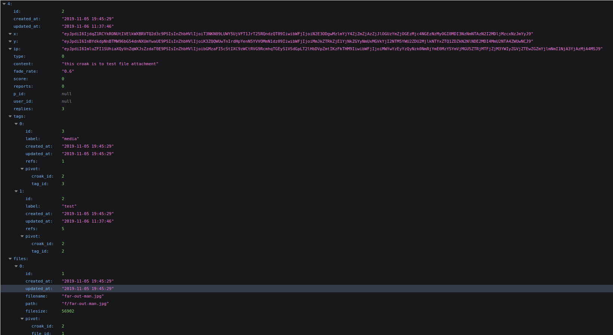
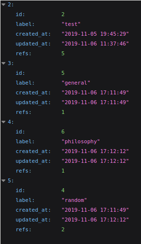

# Frog Pond API:

This Laravel application provides an API for frogpond, to enable developers to access and create croaks, files, and tags. It can be used with any database server, but I use PostgresQL. 

## How to use the API:

- Resources 
    - Croak:
        - id (int) : primary key
        - created_at (string) : datetime croak was posted
        - updated_at (string) : datetime croak was last updated, presently always same as created
        - x (string) : longitude, encrypted hash string, based on private key of this laravel application
        - y (string) : latitude, encrypted hash string, based on private key of this laravel application
        - ip (string) : ip address of poster of croak, encrypted hash string, based on private key of this laravel application
        - type (int) : what type of croak, always 0 (unused) in FrogPond app
        - content (string) : variable unlimited length text
        - fade_rate (float) : 3 digit precision and 2 decimal digits, unused for FrogPond, was originally supposed to be used for a graphical application where posts would be on 2-dimensional canvas and rendered with decreasing opacity over time
        - score (int) : net result of upvotes (+1) and downvotes (-1)
        - reports (int) : how many times has been reported for illegallity or spam
        - p_id (int) : parent id
        - user_id (int) : user id, unused in FrogPond
    - Tag
        - id (int) : primary key
        - label (string) : the tag/concept/topic, unique, 
        - created_at (string) : datetime tag was created
        - refs (int) : number of times this tag has been referenced (how many croaks are associated with it)
    - File
        - id (int) : primary key
        - created_at (string) : datetime file was uploaded
        - filename (string) : name with extension
        - path (string) : relative to server root (really just "f/" prepended to filename)
        - filesize (int) : in bytes
    - Vote
        - id (int) : primary key
        - ip (string) : ip address of voter (encrypted)
        - v (boolean) : up (true) or down (false) vote
        - created_at (string) : datetime vote was casted
        - croak_id (int) : which croak 
    - Report
        - id (int) : primary key
        - ip (string) : ip address of voter (encrypted)
        - reason (string) : optional why the croak is unallowed
        - created_at (string) : datetime vote was casted
        - croak_id (int) : which croak

    

## REST endpoints:
- GET croaks : returns JSON list of croaks, result based on query parameters
    - parameters
        - tag association: give a list of tags and specify inclusive or exclusive
            - tags : a list of tags separated by commas, 
                - returns JSON list of croaks that have any of the given tags
                - if croaks have to contain all given tags, give parameter mode=1
        - location association: all of the following parameters must be set to get the croaks within some kilometers of some coordinate
            - radius : in km
            - x : longitude
            - y : latitude
        - siblings (comments of a parent croak): 
            - pid : id of the parent croak
            - pid : list of ids of parent croaks separated by spaces, to get comments of multiple croaks
    - example
        - here is the JSON for one croak within the response array returned: 
        - as you can see, the API automatically includes the tags and files associated with the croak in the response, as well as the number of replies. if you include coordinates and radius with your request, there will also be a distance included with each croak (km)
        - [see for yourself](http://grothe.ddns.net:8090/api/croaks)
- POST croaks : submit a new croak
    - required parameters: x, y, content, tags, 
    - optional parameters:
        - p_id : parent id of which this croak is a replay
        - type : if not 0
        - f : one file or an array of files
    - returns the created croaks
    - error message : -1 on failure
- GET tags : returns JSON list of tags, result based on query parameters
    - parameters
        - location association: all of the following parameters must be set to get the tags within some kilometers of some coordinate
            - radius : in km
            - x : longitude
            - y : latitude
        - n : (int) to limit the number of tags received by the top n most-used tags
    - example
        - 
        - [api/tags](http://grothe.ddns.net:8090/api/tags)
- there is currently no POST tags, as tags are meant to be created with croaks. however, i can imagine some use cases for other apps where tags should be able to created alone. 
- GET files : returns a JSON list of files
    <!-- - parameters
        - tags : list of tags separated by commas
            - return only files associated with croaks that are associated with those tags
        - mode : (0 or 1), 0 = associated with any given tag; 1 = associated with all given tags -->
    - construct a url by simply appending path onto the server address, like so: [http://173.22.78.225/f/far-out-man.jpg](http://173.22.78.225/f/far-out-man.jpg)
- POST files : upload one or more files
    - parameters
        - f : file/s
- POST votes : upvote/downvote a croak
    - parameters
        - croak_id
        - v : (int) 0 = downvote ; 1 = upvote
    - only one vote allowed per ip address
- POST report : report a croak for illegal/spam content
    - parameters
        - croak_id
        - reason : (string) optional
    - only one per ip address

# This application also provides a minimal web interface for browsing, viewing, and adding content.
    
